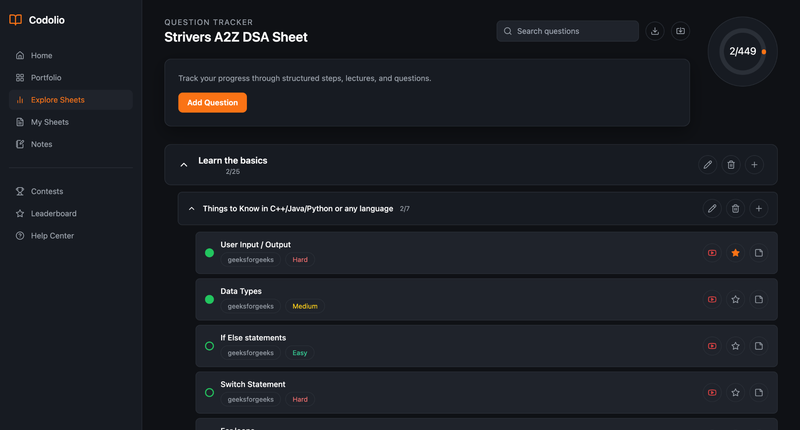
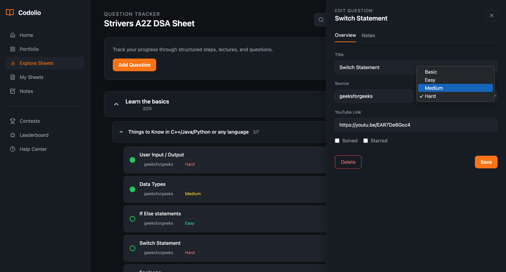
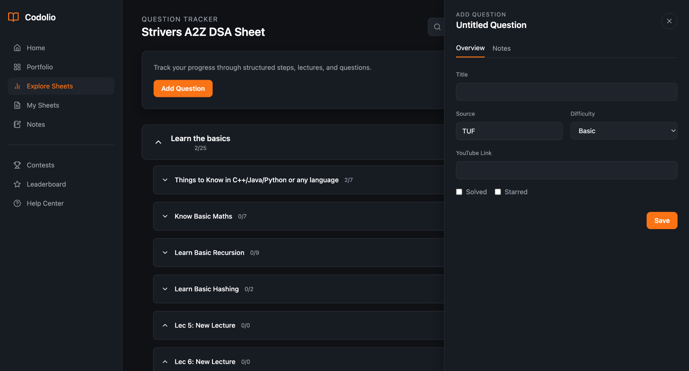

# Interactive Question Management Sheet

A single-page, Codolio-inspired **Question Tracker** that lets users manage a hierarchical sheet of **Topics → Subtopics → Questions** with full CRUD, drag-and-drop reordering, progress tracking, and a right-side editor drawer.

Built as a lightweight monorepo:
- **Client:** React + Vite + TailwindCSS + Zustand + dnd-kit
- **Server:** Node.js + Express + TypeScript (JSON persistence, no DB required)

---

## Website Screenshots

### 1) Sheet View (Topics → Subtopics → Questions)


### 2) Edit Question Drawer (Overview / Notes)


### 3) Add Question Flow


---

## Key Features

### Core Requirements 
- **Topics:** Create / Edit / Delete
- **Subtopics:** Create / Edit / Delete (nested under topics)
- **Questions:** Create / Edit / Delete (nested under subtopics)
- **Reorder with Drag & Drop**
  - Reorder **topics**, **subtopics**, and **questions**
  - Move **questions across subtopics**

### UX & Product Polish 
- Codolio-style **dark UI** with orange accents
- Accordion navigation for large sheets
- **Right-side drawer** editor with tabs: *Overview* / *Notes*
- **Progress tracking** (solved/total)
- **Search** (title/source/difficulty)
- **Show More / Show Less** pagination inside a subtopic (prevents huge dumps)
- Clickable interactions:
  - **Question title** opens problem link (if available)
  - **YouTube icon** opens video link (if available)

---

## Setup
### Monorepo (single command)
```bash
npm install
npm run dev
```
- Client: http://localhost:5173
- Server: http://localhost:3001

### Split terminals
```bash
npm --prefix server run dev
```
```bash
npm --prefix client run dev
```

## API Routes
- `GET /api/sheet`
- `POST /api/topics`
- `PATCH /api/topics/:topicId`
- `DELETE /api/topics/:topicId`
- `POST /api/topics/:topicId/subtopics`
- `PATCH /api/subtopics/:subTopicId`
- `DELETE /api/subtopics/:subTopicId`
- `POST /api/subtopics/:subTopicId/questions`
- `PATCH /api/questions/:questionId`
- `DELETE /api/questions/:questionId`
- `POST /api/reorder`
- `GET /api/export`
- `POST /api/import`

## Persistence + Seed
- On server boot, `server/data/state.json` is loaded if it exists.
- If missing, the server reads `server/seed/sheet.json`, transforms it into the Topic → SubTopic → Question hierarchy, and persists it to `server/data/state.json`.
- All mutations update the persisted JSON file so the UI remains consistent after refresh/restart.

### Reset seed
To rebuild state from the seed file, delete the persisted state file and restart the server:
```bash
rm -f server/data/state.json
```
